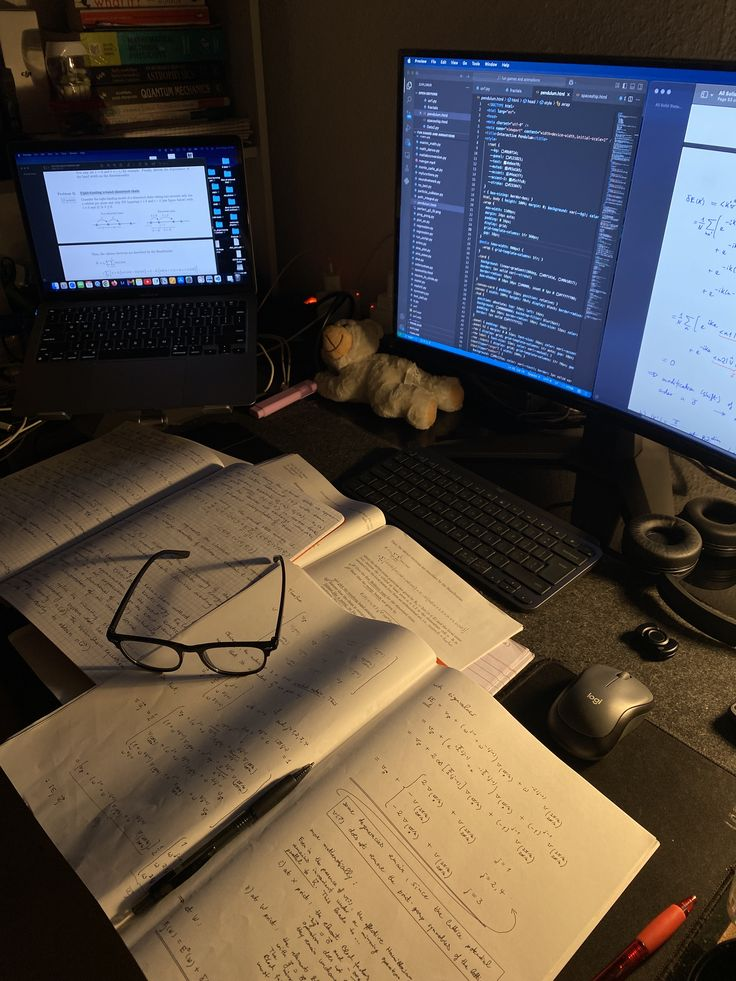

<table>
<tr>
<td width="60%">

# Salut 👋, je suis Mohamed Flifel
### 💡 Étudiant en Informatique · Développeur Web · Passionné d'IA

🎓 Étudiant en Sciences Informatiques à l'**ISI Tunisie**

Je suis un créateur dans l'âme — que ce soit pour développer des applications full-stack, expérimenter des modèles de ML, ou transformer une idée random en vrai projet à 2h du matin.

Je suis attiré par l'intersection entre **le génie logiciel** et **l'intelligence artificielle** — là où un code propre rencontre des systèmes intelligents.

- 🔭 En train de construire des **applications propulsées par l'IA**
- 🌱 En exploration du **Machine Learning** & **Deep Learning**
- 🛠️ À l'aise sur toute la stack — du front au back
- 🧩 J'adore résoudre des problèmes complexes avec des solutions élégantes
- 🤝 Ouvert aux **collaborations**, **stages**, et aux idées originales

> *Le code est mon art. L'IA est ma curiosité. Construire est mon mode par défaut.*

</td>
<td width="40%" align="center">

  

</td>
</tr>
</table>

---

## 🛠️ Stack Technique

### 🌐 Front-End

  

### ⚙️ Back-End & Full-Stack

  

### 🤖 IA / ML

  

### 🗄️ Bases de Données

  

### 🧰 Outils & Environnement

  

---

## 🧠 Méthodologies & Pratiques

- APIs RESTful · MVC & Design Patterns
- Agile · Scrum
- POO · Clean Code

---

## 📊 Statistiques GitHub

  
  

---

## 📫 Me Contacter

  
  
  

---

✨ *Toujours en apprentissage. Toujours en construction. Toujours en train de livrer.*
🚀 *Construisons ensemble quelque chose qui compte.*
